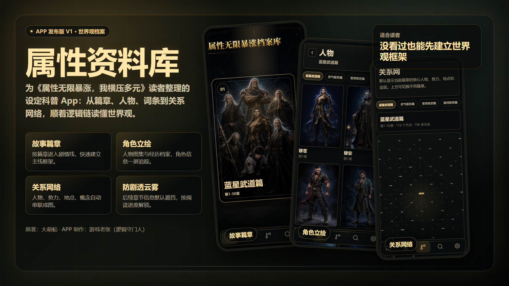
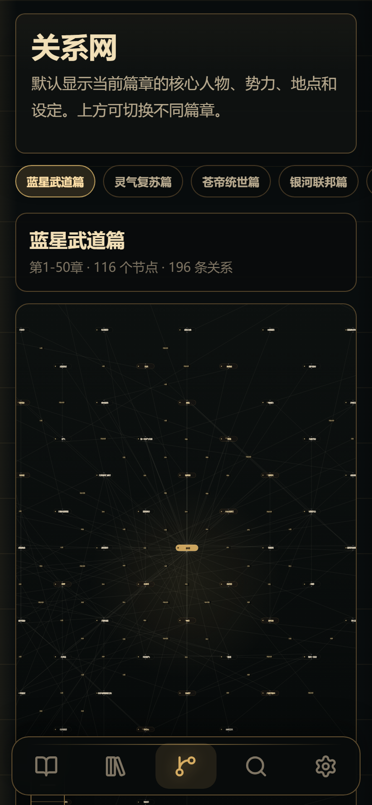

# 属性资料库

《属性资料库》是为《属性无限暴涨，我横压多元》读者整理的粉丝向设定档案 App。

它适合想快速补世界观、查人物经历、梳理设定关系的读者使用。没看过原文的读者，也可以先通过篇章、人物、词条和关系网建立整体框架；已经追更的读者，则可以把它当作随手查询的设定资料库。

## 下载

安卓版 APK：

[下载属性资料库.apk](https://github.com/nizohannemanncq386-svg/Stats-library/releases/latest/download/Stats-library.apk)

安装时如果手机提示“未知来源应用”，需要在系统设置里允许本次安装。安装后桌面显示名称为 **属性资料库**。

## 主要功能

- **故事篇章**：按篇章浏览世界观和剧情线，先从大框架理解故事。
- **人物档案**：查看角色立绘、身份、境界变化、人物经历和相关词条。
- **设定词条**：整理境界体系、能力功法、势力组织、地域名录、数据资料等信息。
- **关系网络**：把人物、势力、地点和概念串成关系图，方便顺着线索追踪。
- **防剧透云雾**：超出当前阅读进度的信息会被遮挡，需要时再手动揭开。
- **逻辑守门人引导**：首次进入会有简短说明，帮助理解云雾遮挡和关系链追踪。

## 截图

| 故事篇章 | 角色图集 | 关系网络 |
| --- | --- | --- |
|  |  |  |

## 当前开放范围

首版开放前六个篇章：

1. 蓝星武道篇
2. 灵气复苏篇
3. 苍帝统世篇
4. 银河联邦篇
5. 幻想域篇
6. 五维升维篇

后续篇章暂未开放，进入时会有提示。

## 说明

原著：大萌蛇  
APP 制作：游戏老张（逻辑守门人）

本 App 是粉丝向资料整理与阅读辅助工具，用于帮助读者理解设定、篇章和人物关系。小说原文、世界观和角色设定归原作者及相关权利方所有。
